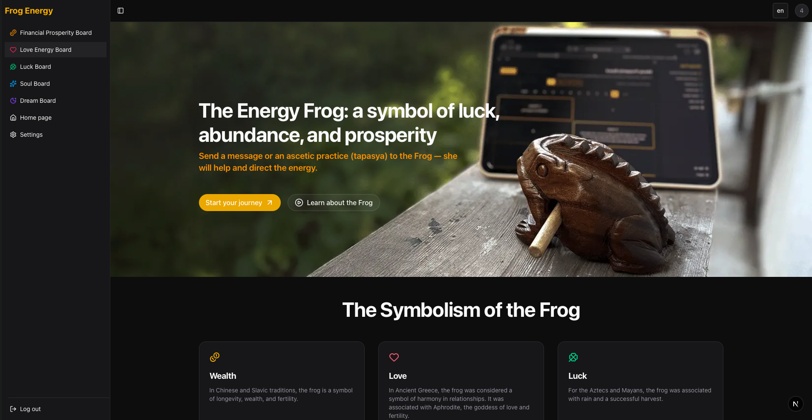
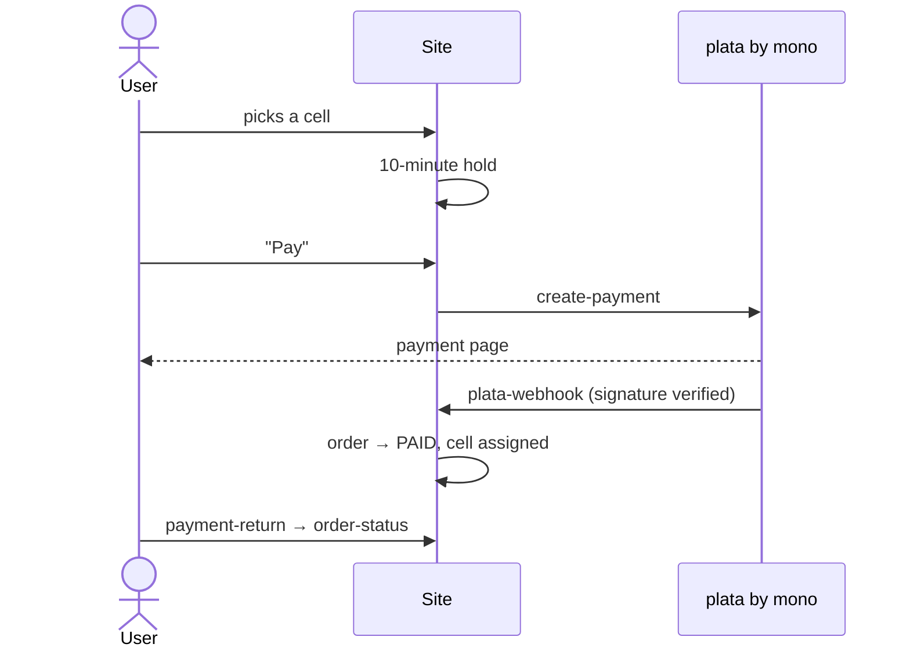

<div align="center">

# 🐸 Frog Energy

**Public intention boards, charged by a musical frog.**
Pick a board, claim a cell, write your intention — and let the Frog charge it.

[frog-energy.com](https://frog-energy.com)




</div>

---

## ✨ Features

| | |
|---|---|
| 🪙 **Five boards** | Money, love, luck, soul, dream — each with its own cells, likes and pagination |
| 🛒 **Buying a cell** | 10-minute hold, payment via plata by mono, webhook and order reconciliation |
| 🌍 **7 languages** | en · de · es · fr · pt · ru · ua — detected from the browser |
| 🔐 **Accounts** | Sign-up, sign-in, password reset by email code, profile settings |
| 🛠️ **Admin panel** | All cells in one table, deletion with a reason, free cells, “info of the week” |
| 🍪 **Cookie consent** | GTM, Meta Pixel and Google Ads load only after consent (Consent Mode v2) |
| 🔎 **SEO** | Sitemap with hreflang, robots, manifest, icons, Open Graph |
| 🌙 **Dark theme** | shadcn/ui on Base UI, Tailwind CSS 4 |

## 🧰 Tech stack

- **[Next.js 16](https://nextjs.org)** — App Router, Turbopack, `proxy.ts`, `next/root-params`, `global-not-found`
- **React 19**
- **[shadcn/ui](https://ui.shadcn.com)** (Base UI), **Tailwind CSS 4**, lucide-react, sonner
- **[Prisma 7](https://www.prisma.io)** + `@prisma/adapter-pg`, **PostgreSQL**
- **zod 4** + react-hook-form — one schema for client and server
- **jose** (session in a signed cookie), **bcryptjs**, **nodemailer**

## 🚀 Getting started

You need **Node.js 20+** and **PostgreSQL**.

```bash
npm install
```

Create a `.env` file (see [environment variables](#-environment-variables)), then apply the migrations and generate the Prisma client:

```bash
npx prisma migrate deploy --config prisma7.config.ts
```

```bash
npx prisma generate --config prisma7.config.ts
```

Start the dev server:

```bash
npm run dev
```

Open [http://localhost:3000](http://localhost:3000) — you will be redirected to the site in your browser's language.

### Scripts

| Command | What it does |
|---|---|
| `npm run dev` | dev server (Turbopack) |
| `npm run build` | production build |
| `npm run start` | run the production build |
| `npm run lint` | ESLint |

## 🔑 Environment variables

| Variable | Required | Purpose |
|---|:---:|---|
| `DATABASE_URL` | ✅ | PostgreSQL connection string |
| `SESSION_SECRET` | ✅ | secret that signs the session (`openssl rand -base64 32`) |
| `ADMIN_EMAILS` | | comma-separated admin emails — access to `/admin` |
| `PLATA_API_BASE_URL` | | plata by mono API |
| `PLATA_BY_MONO_TOKEN` | | plata by mono merchant token |
| `NEXT_PUBLIC_APP_URL` | | site URL to return to after payment |
| `SITE_URL` | | site URL used in emails (defaults to `https://frog-energy.com`) |
| `SMTP_HOST`, `SMTP_PORT`, `SMTP_USER`, `SMTP_PASS` | | mail server for reset codes and payment emails |
| `SMTP_FROM`, `SMTP_SECURE` | | sender and TLS (port 465 enables TLS on its own) |
| `NEXT_PUBLIC_GTM_ID` | | Google Tag Manager |
| `NEXT_PUBLIC_META_PIXEL_ID` | | Meta Pixel |
| `NEXT_PUBLIC_GOOGLE_ADS_ID` | | Google Ads |

> [!TIP]
> Without the `NEXT_PUBLIC_*` ids the trackers never load, so local development doesn't pollute your analytics.
> These variables are inlined at build time — run `npm run build` again after changing them.

## 🗂️ Project structure

```text
app/
├── [lang]/                     # every page; the language is a root param
│   ├── (boards)/               # money · love · luck · soul · dream
│   │   ├── _components/        # shared board page, cells, pagination
│   │   ├── _data.ts            # queries used only by the boards
│   │   └── _dict.ts            # dictionary slice for client components
│   ├── admin/  buy/  home/  settings/  login/  registration/  forgot/ …
│   ├── _actions/               # Server Actions shared by several pages
│   ├── components/             # shared components and components/ui (shadcn)
│   └── layout.tsx
├── api/                        # create-payment · order-status · plata-webhook · reconcile-order
├── global-not-found.tsx        # 404 for any unknown URL
├── robots.ts  sitemap.ts  manifest.json
dictionaries/                   # en.json … ua.json
lib/                            # code shared by several pages (server-only)
prisma/                         # schema.prisma and migrations
proxy.ts                        # locale redirect, x-lang header
```

### Conventions

- **`_actions/`** — only `"use server"` functions the browser calls. Each one checks the session and validates its input itself: they are public POST endpoints.
- **`_data.ts`** next to a page — queries only that page needs (`import "server-only"`).
- **`_dict.ts`** next to a page — the dictionary slice passed to client components.
- **`lib/`** — code used by several pages or API routes.
- `userId` never comes from the client — the server always takes it from the session.

## 💳 Payment flow



If the webhook never arrives, `reconcile-order` checks the order status with plata by mono directly. The switch to `PAID` is atomic, so an order can't be fulfilled twice.

## 🌍 Adding a language

1. Copy `dictionaries/en.json` to `dictionaries/<code>.json` and translate it.
2. Add the code to `locales` in [`i18n-config.ts`](i18n-config.ts).
3. Register the dictionary in [`get-dictionary.ts`](get-dictionary.ts).
4. Add the language name to the list in [`toggle-language.tsx`](app/%5Blang%5D/components/toggle-language.tsx).

The sitemap and the browser-language redirect pick it up automatically.

---

<div align="center">

Made with 🐸 and music

</div>
